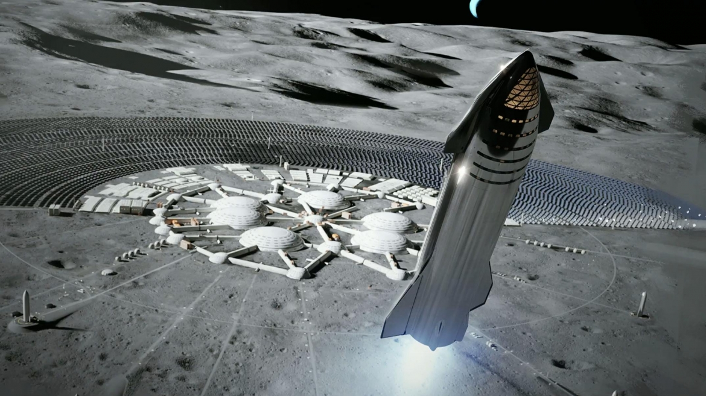

Since the presentation by Elon Musk at Boca Chika on Saturday 28th September there has been considerable fallout and developments. There are also consequences that will be felt in the industry and around the world for decades to come.

On the presentation itself, much can be made of the build-up to the event. The Mark 1 Starship was being rapidly assembled in the open in a field in Texas. For high tech, this is mind-blowing. We have been fed the idea for generations now that rocket building is fragile and requires extremely exacting manufacture. And yet, in that field the upper stage of a monster rocket has been assembled.

I wont dwell on the statistics for this machine save that it is truly enormous and represents a massive leap beyond anything available now or for the next 50 years from anyone else. Seeing the fins and canards, the engines and the two halves mated in a very short time was surreal. In a world where we have the SLS taking 12 years so far to produce a bunch of test articles and yet to assemble the first flight vehicle for its launch sometime in 2021 now if not 2022, it can be difficult to imagine this speed of assembly and testing.

The testing will be flight testing as well. From an industry where everything is thrown away, testing is done in expensive rigs on the ground in very limited ways. Starship testing involves a number of test articles of increasing fidelity building up actual flight experience. This will give engineers actual flight data to lower the risk of their designs. It also builds a body of experience in how components and materials actually perform in flight. This will produce simultaneously a more optimised and conservative design.

The move to stainless steel instead of composites has been considered by multiple pundits as a great move. It introduces a level of ruggedness and reparability that composites cannot match. One area of concern has been how do you effect repairs on a planet very far from home. Composites do not do this. Steel does. Put simply a fitter may be a necessary crew member amongst a dozen people heading to the Moon or Mars. Another aspect that cannot be understated is cost. Stainless steel is much cheaper by around 50 times compared to composites on a per tonne basis. This helps free up budget for a lot of additional testing as well as cost reductions in production builds.

One potential consequence of this is that construction of these rockets could be a lot simpler than originally thought. This could open up rocket building to many more actors than presently involved.

The first ripples felt from this event actually occurred before-hand. The NASA Administrator, Jim Bridenstein tweeted that he would like to see Spacex more enthusiastic for commercial crew. The tweet is only mystifying if taken at face value. It appears to be more of a cover for SLS that is now embarrassing. SLS is slow and chewing up much needed capital at a ferocious rate. This tweet has exposed NASA to being effectively a joke in regards to this situation. Even worse very few people even believe SLS will ever fly. NASA itself doesn’t think it will go beyond a handful as the long term needs of a sustainable program such as an enhanced second stage to give the rocket a minimal set of needs has been cannibalized for increasing costs for the test article. The SLS program is approaching a level of stench that will keep a lot of politicians away who would otherwise lend their support. If this keeps on it will prove fatal to this unpopular program.

One interesting outcome has been a switch from this being a pipedream to people now asking second order questions about the ship. This includes life-support and radiation shielding. I am not worried about these issues yet as some 5% of the company is devoted to the project thus far, or approx. 300 people. When the additional systems need to be designed and built, these people will be brought in. As crew dragon starts to wind down, this will be a certainty.

One observation was that of comments by NASA management privately disbelieving what is occurring. This can be said to be in part due to the glacial movement exhibited by NASA. The last several decades have featured programs that have barely moved in the space of a decade or more. The SLS and Orion are simply the latest in this trend where jobs are more important than achieving anything. At the speed Spacex are moving by the time NASA progress from disbelief to anger SpaceX will be flying around the Moon.
There were some press releases highlighting SLS mock ups being moved around to practice moving real elements. These were met with derision. The gov’t program has been deeply unpopular within space circles but now that unpopularity is spilling over to the wider public and transforming into an embarrassment.

Elon Musk, afterwards has been revealing additional details. Thermal protection being chief among those details as well as the testing regime. Thermal tiles will be used as well as testing initially to 20 km and then aiming to orbit. It is unclear if that will be with either of the two current prototypes. My opinion is that it will likely be with the next 2 starships being constructed. These 2 will likely be much tighter mass wise with improved manufacturing methods.

There will be further issues arising from this event but with little over a week since it occurred there simply hasn’t been much time. The ripples are yet to be fully felt.
